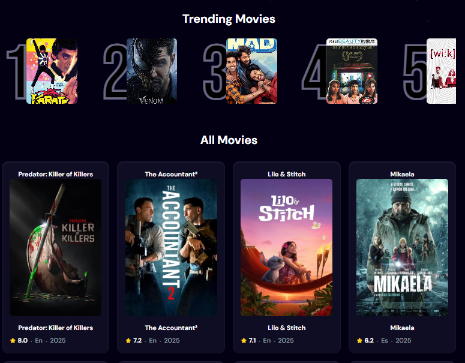

<div align="center">
  <br />
      
  <br />
  <div>
    
    
    
  </div>

  <h3 align="center">A Movie Application</h3>
  <a href="https://movie-app.learnwithsabbir.com/" target="_blank">[Live Preview]
</div>
## <a name="quick-start">Quick Start</a>

Follow these steps to set up the project locally on your machine.

**Prerequisites**

Make sure you have the following installed on your machine:

- [Git](https://git-scm.com/)
- [Node.js](https://nodejs.org/en)
- [npm](https://www.npmjs.com/) (Node Package Manager)

**Cloning the Repository**

```bash
git clone https://github.com/sabbir534/movie-app-react.git
cd movie-app-react

```

**Installation**

Install the project dependencies using npm:

```bash
npm install
```

**Set Up Environment Variables**

Create a new file named `.env.local` in the root of your project and add the following content:

```env
VITE_TMDB_API_KEY=

VITE_APPWRITE_PROJECT_ID=
VITE_APPWRITE_DATABASE_ID=
VITE_APPWRITE_COLLECTION_ID=
```

Replace the placeholder values with your actual **[TheMovieDatabase API](https://developer.themoviedb.org/reference/intro/getting-started)** and **[Appwrite](https://appwrite.io/)** credentials.

**Running the Project**

```bash
npm run dev
```

Open [http://localhost:5173](http://localhost:5173) in your browser to view the project.
